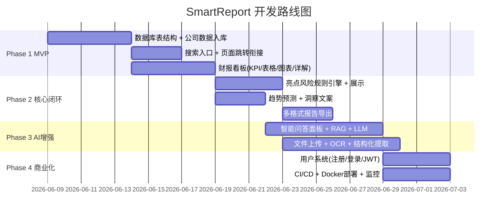

# SmartReport — 各模块开发方案与计划

> 基于 `tech-design.md` + `tech-plan.md`，面向 10 个 Epic 的详细开发实施方案  
> 日期：2026-06-06  
> 状态：脚手架阶段，所有模块从零实施

---

## 总览：四阶段迭代路线



| 阶段 | 周期 | Epic | 核心交付 |
|------|------|------|----------|
| **Phase 1 MVP** | 2-3 周 | data-engine, search-load, dashboard | 搜索公司 → 查看财报 KPI/表格/图表 |
| **Phase 2 核心闭环** | 2-3 周 | risk-highlight, predict, export | 亮点风险 + 趋势预测 + 报告导出 |
| **Phase 3 AI 增强** | 3-4 周 | chat, upload | 智能问答(RAG+LLM) + 文件上传解析 |
| **Phase 4 商业化** | 2-3 周 | auth, infra | 用户系统 + CI/CD + 监控 |

---

## 并行执行建议

```
Phase 1 可并行:
  ├─ Story 1.1 (数据库) ──────────────┐
  ├─ Story 1.3 (计算引擎) ── 依赖1.1 ─┤ 完成后 → Story 1.4
  └─ Story 2.1 (搜索UI) + 1.2 (API) ─┘ → Story 2.2 → Story 2.3
                                       → Story 3.1 → 3.2 → 3.3/3.4(并行)

Phase 2 可并行:
  ├─ Epic 4.1+4.2 (亮点+风险) ── 并行 ──┐
  ├─ Epic 5.1+5.2 (预测)       ── 并行 ──┤
  └─ Epic 8.1 (导出)           ── 并行 ──┘

Phase 3 可并行:
  ├─ Epic 6 (聊天) ── 并行 ──┐
  └─ Epic 7 (上传) ── 并行 ──┘

Phase 4:
  ├─ Epic 9 (用户) ── 并行 ──┐
  └─ Epic 10 (基建) ── 并行 ──┘
```

---

## Phase 1: MVP（搜索 + 财报数据 + 看板）

### Epic 1: 财报数据引擎 `data-engine` [P0]

**目标**：建立完整的数据底座——数据库表结构、公司基础数据入库、财报指标计算引擎、行业均值数据。

---

#### Story 1.1 — 数据库表结构创建

**步骤**
1. 编写 MySQL DDL 脚本 `devops/mysql/sql/01-init.sql`（基于 tech-design.md 第一节 ER 图，创建全部 17 张表）
2. 编写种子数据脚本 `devops/mysql/sql/02-seed-company.sql`（预置沪深 300 公司基础数据）
3. 编写种子数据脚本 `devops/mysql/sql/03-seed-financial.sql`（预置 5 年财报模拟数据 + 行业均值）
4. 配置 Spring Boot `application.yml`：数据源、JPA/Hibernate、连接池 HikariCP
5. 创建 JPA Entity 类（`backend/src/main/java/com/smartreport/models/entity/`）
   - `Company.java`, `FinancialReport.java`, `FinancialIndicator.java`, `IndicatorDefinition.java`
   - `IndustryAverage.java`, `HighlightRule.java`, `RiskRule.java`, `AnalysisReport.java`
   - `ReportHighlight.java`, `ReportRisk.java`, `ChatMessage.java`, `UserSearchHistory.java`
   - `UserFavorites.java`, `ExportRecord.java`, `MqTaskRecord.java`, `ReportFile.java`, `CompanyIndustryTag.java`
6. 创建 Spring Data JPA Repository 接口（`backend/.../repository/`）
7. 编写 `SmartReportApplicationTests.java` 基础验证测试（数据源连接、表创建）

**关键文件**
| 文件 | 说明 |
|------|------|
| `devops/mysql/sql/01-init.sql` | 17 张表 DDL |
| `devops/mysql/sql/02-seed-company.sql` | 公司种子数据 |
| `devops/mysql/sql/03-seed-financial.sql` | 财报种子数据 |
| `backend/src/main/resources/application.yml` | 数据源配置 |
| `backend/.../models/entity/*.java` | 全部 17 个 JPA Entity |
| `backend/.../repository/*.java` | 全部 17 个 Repository |

**验证**
1. `docker-compose up mysql` → 自动执行 init.sql，验证 17 张表创建成功
2. Spring Boot 启动 → Hibernate 自动验证表映射无报错
3. 运行 `SmartReportApplicationTests` → 数据源连接 + JPA 查询通过

---

#### Story 1.2 — 上市公司基础信息入库

> ⚠️ 依赖 Story 1.1

**步骤**
1. 实现 `CompanyRepository`：`findByCode()`, `findByNameContainingOrCodeContaining()`
2. 实现 `CompanyService`：搜索逻辑（模糊匹配、分页、热门公司）
3. 实现 `GET /api/v1/search/companies` 搜索接口（`SearchController`）
4. 实现 `GET /api/v1/search/companies/hot` 热门公司接口
5. 编写数据初始化脚本：从公开数据源（Tushare/AKShare）批量导入 A 股公司 → Python 脚本放在 `ai-engine/app/services/data_importer.py`
6. 前端：创建 `frontend/src/types/index.ts` TypeScript 类型定义（Company、SearchResult 等）
7. 前端：创建 `frontend/src/api/index.ts` API 调用层（axios 封装 + 搜索接口）

**关键文件**
| 文件 | 说明 |
|------|------|
| `backend/.../controller/SearchController.java` | 搜索 API |
| `backend/.../service/SearchService.java` | 搜索逻辑 |
| `ai-engine/app/services/data_importer.py` | 数据导入脚本 |
| `frontend/src/types/index.ts` | TS 类型定义 |
| `frontend/src/api/index.ts` | API 调用层 |

**验证**
1. 调用 `GET /api/v1/search/companies?q=茅台&limit=8` → 返回贵州茅台
2. 调用 `GET /api/v1/search/companies/hot` → 返回 6 家热门公司
3. 前端 dev server 启动 → 搜索框可调用后端接口

---

#### Story 1.3 — 财报指标计算引擎

> ⚠️ 依赖 Story 1.1

**步骤**
1. 实现 `IndicatorService`：
   - `calculateYoY(current, previous)` → 同比变化率
   - `calculateQoQ(current, previous)` → 环比变化率
   - `calculateCAGR(values, years)` → 复合增长率
   - `calculateRatio(numerator, denominator)` → 比率类（毛利率、净利率、ROE）
   - 边界处理：除零返回 null、负数正常计算
2. 实现 `IndicatorRepository`：`findByReportId()`, `findByCompanyCodeAndYears()`
3. 编写 `IndicatorServiceTest.java` 单元测试覆盖所有计算类型

**关键文件**
| 文件 | 说明 |
|------|------|
| `backend/.../service/IndicatorService.java` | 接口 |
| `backend/.../service/IndicatorServiceImpl.java` | 实现 |
| `backend/src/test/java/.../service/IndicatorServiceTest.java` | 单元测试 |

**验证**
1. 单元测试全部通过（边界值：除零、负数、null、正常值）
2. 同比计算：`(current-prev)/prev*100` 公式验证

---

#### Story 1.4 — 行业均值与排名数据

> ⚠️ 依赖 Story 1.1, 1.3

**步骤**
1. 填充 `industry_averages` 表数据（种子 SQL 中预置白酒、银行等行业均值）
2. 实现 `BenchmarkService`：行业均值查询 + 排名计算（如"毛利率行业前 10%"）
3. 实现 `GET /api/v1/analysis/{companyCode}/benchmark` 接口
4. 前端：指标详解表中渲染"行业均值"和"行业对比"列

**关键文件**
| 文件 | 说明 |
|------|------|
| `backend/.../service/BenchmarkService.java` | 基准对比服务 |
| `backend/.../controller/AnalysisController.java` | benchmark 端点 |
| `devops/mysql/sql/03-seed-financial.sql` | 行业均值数据 |

**验证**
1. `GET /api/v1/analysis/600519/benchmark` → 返回白酒行业均值对比数据
2. 排名格式："毛利率行业前 10%"、"资产负债率行业后 20%"

---

### Epic 2: 公司搜索与加载 `search-load` [P0]

**目标**：实现完整的搜索→加载→主控台用户闭环。

---

#### Story 2.1 — 统一搜索入口

> ⚠️ 依赖 Epic 1 Story 1.2

**步骤**
1. 前端：`SearchView.vue` 搜索框组件
   - debounce 300ms 输入 → 调用 `GET /api/v1/search/companies`
   - 搜索建议下拉 UI（高亮匹配字符、行业标签 Chip）
   - 键盘导航（↑↓ 选择、Enter 确认、Esc 关闭）
   - 空状态 / 无结果状态处理
2. 前端：`composables/useSearch.ts` 封装搜索逻辑（防抖、请求取消）
3. 前端：`stores/searchStore.ts` Pinia store（搜索结果、加载状态）

**关键文件**
| 文件 | 说明 |
|------|------|
| `frontend/src/views/SearchView.vue` | 搜索页面 |
| `frontend/src/composables/useSearch.ts` | 搜索逻辑 |
| `frontend/src/stores/searchStore.ts` | 搜索状态管理 |

**验证**
1. 输入"茅台" → 300ms 后显示下拉建议列表
2. ↑↓ 键切换高亮项，Enter 确认跳转
3. 输入"xyz123" → 显示"未找到匹配公司"

---

#### Story 2.2 — 页面间参数传递与加载衔接

> ⚠️ 依赖 Story 2.1

**步骤**
1. 前端：路由配置 `/search` → `/dashboard/:code`（`router/index.ts`）
2. 前端：`DashboardView.vue` 从路由参数 `$route.params.code` 读取公司代码
3. 前端：`useDashboard.ts` composable —— 调用 `GET /api/v1/reports/{code}/latest` 加载数据
4. 前端：加载骨架屏组件 `SkeletonCard.vue`（替代 blank 闪烁）
5. 后端：实现 `GET /api/v1/reports/{companyCode}/latest`（`ReportController`）

**关键文件**
| 文件 | 说明 |
|------|------|
| `frontend/src/router/index.ts` | 路由配置 |
| `frontend/src/views/DashboardView.vue` | 主控台页面 |
| `frontend/src/composables/useDashboard.ts` | 数据加载 |
| `frontend/src/components/SkeletonCard.vue` | 骨架屏 |
| `backend/.../controller/ReportController.java` | 财报 API |

**验证**
1. 搜索"600519" → 回车 → 路由跳转 `/dashboard/600519`
2. Dashboard 显示骨架屏 → 数据加载完成后渲染 KPI 卡片

---

#### Story 2.3 — 分析历史管理

> ⚠️ 依赖 Story 2.2（可并行）

**步骤**
1. 前端：`useHistory.ts` composable —— `localStorage` 存储最近 20 条分析记录
2. 前端：历史下拉列表组件 `HistoryDropdown.vue`（相对时间展示："3 分钟前"）
3. 前端：`Navbar.vue` 集成历史下拉 + 最近分析时间戳
4. 后端（P3 迁移时启用）：`HistoryController` → `GET/POST /api/v1/history`

**关键文件**
| 文件 | 说明 |
|------|------|
| `frontend/src/composables/useHistory.ts` | 历史管理 |
| `frontend/src/components/HistoryDropdown.vue` | 历史下拉 |
| `frontend/src/components/Navbar.vue` | 导航栏 |

**验证**
1. 分析 3 家公司后 → 历史下拉显示 3 条记录
2. 点击历史项 → 重新加载对应公司数据
3. 刷新页面 → localStorage 持久化不丢失

---

### Epic 3: 财报总览看板 `dashboard` [P1]

**目标**：Dashboard 页面完整渲染 KPI 卡片、数据表格/图表、指标详解表。

---

#### Story 3.1 — KPI 指标卡片

> ⚠️ 依赖 Epic 2 Story 2.2

**步骤**
1. 后端：实现 `GET /api/v1/reports/{companyCode}/kpi`（`ReportController`）
   - 返回最新年份 4 个核心 KPI：营收、归母净利润、资产负债率、经营现金流
   - 每个 KPI 含：`value`, `unit`, `yoy`（同比变化率）, `trend`（up/down/down_good）
2. 前端：`KpiCards.vue` 组件 —— 4 卡片响应式 Grid 布局
3. 前端：数字滚动动画（count-up effect）
4. 前端：同比箭头 ↑↓ 颜色逻辑：金融行业惯例（绿涨红跌，资产负债率反向）

**关键文件**
| 文件 | 说明 |
|------|------|
| `backend/.../controller/ReportController.java` | kpi 端点 |
| `backend/.../service/ReportService.java` | 财报服务 |
| `frontend/src/components/KpiCards.vue` | KPI 卡片 |

**验证**
1. Dashboard 加载后 → 4 张 KPI 卡片渲染正确数值和单位
2. 同比为正 → 绿色 ↑ 箭头；同比为负 → 红色 ↓ 箭头
3. 资产负债率下降 → 绿色（down_good），箭头向下但为正面

---

#### Story 3.2 — 关键数据速览表格

> ⚠️ 依赖 Story 3.1（可并行）

**步骤**
1. 后端：实现 `GET /api/v1/reports/{companyCode}/timeline`（`ReportController`）
   - 支持 `?metrics=revenue,profit,grossMargin,debtRatio,cashFlow` 参数选择
   - 返回 5 年数据数组
2. 前端：`DataTable.vue` 组件 —— 响应式表格（sticky 表头、斑马纹、横向滚动）
3. 前端：`useTimeline.ts` composable 封装数据获取与格式化

**关键文件**
| 文件 | 说明 |
|------|------|
| `frontend/src/components/DataTable.vue` | 数据表格 |
| `frontend/src/composables/useTimeline.ts` | 时间线数据 |

**验证**
1. 表格 5 行 × 5 年数据正确渲染
2. 移动端横向滚动正常
3. 切换公司 → 表格数据更新

---

#### Story 3.3 — 折线图趋势展示

> ⚠️ 依赖 Story 3.2

**步骤**
1. 安装 Chart.js：`npm install chart.js vue-chartjs`
2. 前端：`TrendChart.vue` 组件 —— Chart.js 折线图封装
   - 支持动态切换 dataset（指标切换）
   - Tooltip 格式化（单位、千分位）
   - 图表实例 destroy 后重建（避免内存泄漏）
3. 前端：`MetricTabs.vue` 指标切换按钮组
4. 前端：`useChart.ts` composable 封装 Chart.js 实例管理

**关键文件**
| 文件 | 说明 |
|------|------|
| `frontend/src/components/TrendChart.vue` | 折线图 |
| `frontend/src/components/MetricTabs.vue` | 指标切换 |
| `frontend/src/composables/useChart.ts` | Chart 管理 |

**验证**
1. 切换到"折线图"视图 → Chart.js 折线图渲染
2. 点击"净利润"Tab → 图表切换为净利润折线
3. 切换公司 → 旧 chart destroy + 新 chart 创建，无内存泄漏

---

#### Story 3.4 — 核心财务指标详解表

> ⚠️ 依赖 Story 3.1, Epic 1 Story 1.4

**步骤**
1. 后端：实现 `GET /api/v1/reports/{companyCode}/indicators`（5 个核心指标详情）
2. 后端：实现 `GET /api/v1/terms` 返回术语解释字典
3. 前端：`IndicatorDetail.vue` 组件
   - 带 Tooltip 的术语标签（`?` 悬浮显示解释）
   - 评价 Tag 组件（优秀/良好/健康/关注，颜色区分）
   - 行业对比列

**关键文件**
| 文件 | 说明 |
|------|------|
| `frontend/src/components/IndicatorDetail.vue` | 指标详解表 |
| `frontend/src/components/TermTooltip.vue` | 术语提示 |

**验证**
1. 5 个指标详解行正确渲染
2. 鼠标悬浮 `?` 图标 → 显示白话术语解释
3. 评价 Tag 颜色正确（优秀=绿、关注=橙）

---

## Phase 2: 核心闭环（风险亮点 + 预测 + 导出）

### Epic 4: 风险与亮点分析 `risk-highlight` [P1]

**目标**：基于规则引擎自动识别经营亮点和风险项。

---

#### Story 4.1 — 经营亮点识别与展示

> ⚠️ 依赖 Phase 1 完成

**步骤**
1. 数据库：填充 `highlight_rules` 表（毛利率>80%→盈利能力卓越、现金流>净利润→利润含金量高等）
2. 后端：`HighlightService` —— 规则引擎
   - 读取 `highlight_rules` 表中 `enabled=1` 的规则
   - 逐条评估 `condition_expr`（如 `debtRatio < 30 AND yoy_change > 0`）
   - 满足条件 → 用实际值填充 `desc_template` 模板
3. 后端：`GET /api/v1/analysis/{companyCode}/highlights`
4. 前端：`HighlightCards.vue` —— 绿色左边框 + icon + 标题 + 描述

**关键文件**
| 文件 | 说明 |
|------|------|
| `backend/.../service/HighlightService.java` | 亮点规则引擎 |
| `frontend/src/components/HighlightCards.vue` | 亮点卡片 |

**验证**
1. 加载贵州茅台 → 亮点卡片显示"品牌护城河深厚"、"盈利能力卓越"
2. 加载高负债公司 → 亮点中无"财务结构安全"

---

#### Story 4.2 — 风险识别与展示

> ⚠️ 依赖 Story 4.1（可并行）

**步骤**
1. 数据库：填充 `risk_rules` 表
2. 后端：`RiskService` —— 规则引擎（同 Story 4.1 架构）
3. 后端：`GET /api/v1/analysis/{companyCode}/risks`
4. 前端：`RiskCards.vue` —— 红色左边框 + icon + 标题 + 描述

**关键文件**
| 文件 | 说明 |
|------|------|
| `backend/.../service/RiskService.java` | 风险规则引擎 |
| `frontend/src/components/RiskCards.vue` | 风险卡片 |

**验证**
1. 加载增速放缓的公司 → 风险卡片显示"利润增速放缓"
2. 加载白酒公司 → 风险卡片显示"政策监管风险"

---

### Epic 5: 趋势预测 `predict` [P1]

**目标**：基于历史数据外推预测 + 洞察文案生成。

---

#### Story 5.1 — 趋势预测图表

> ⚠️ 依赖 Phase 1 完成

**步骤**
1. 后端：`PredictService` —— 简单线性回归 / 移动平均预测算法
   - 输入：5 年历史 revenue/profit 数组
   - 输出：2025E/2026E 预测值 + 置信区间
2. 后端：`GET /api/v1/analysis/{companyCode}/predict`
3. 前端：`PredictChart.vue` —— 双折线图（实际值实线 + 预测值虚线）
   - 预测区间半透明色带（confidence band）
   - 图例标注区分"实际"与"预测"

**关键文件**
| 文件 | 说明 |
|------|------|
| `backend/.../service/PredictService.java` | 预测算法 |
| `frontend/src/components/PredictChart.vue` | 预测图表 |

**验证**
1. 加载贵州茅台 → 预测图表显示实线(2020-2024) + 虚线(2025E-2026E)
2. 预测区间色带渲染正确
3. 切换公司 → 预测数据更新

---

#### Story 5.2 — 预测洞察文案

> ⚠️ 依赖 Story 5.1

**步骤**
1. 后端：`GET /api/v1/analysis/{companyCode}/predict/insights`
   - 模板化洞察生成：营收趋势描述、盈利能力预测、关键假设、风险提示
   - 免责声明强制附加
2. 前端：`InsightPanel.vue` —— 洞察文案面板渲染
3. 前端：`Disclaimer.vue` —— 黄色虚线边框免责声明组件（复用于多处）

**关键文件**
| 文件 | 说明 |
|------|------|
| `backend/.../service/PredictInsightService.java` | 洞察生成 |
| `frontend/src/components/InsightPanel.vue` | 洞察面板 |
| `frontend/src/components/Disclaimer.vue` | 免责声明 |

**验证**
1. 预测洞察显示 4 段文案：趋势/预测/假设/风险
2. 底部强制显示免责声明
3. 不同公司数据 → 洞察文案动态变化

---

### Epic 8: 报告导出 `export` [P2]

**目标**：支持 PNG/PDF/Word/Excel 多格式导出。

---

#### Story 8.1 — 多格式导出（前端实现）

> ⚠️ 依赖 Phase 1 完成

**步骤**
1. 安装依赖：`npm install html2canvas jspdf exceljs`
2. 前端：`useExport.ts` composable
   - PNG：`html2canvas` 截图 → canvas.toBlob → 下载
   - PDF：`html2canvas` → `jsPDF` 分页处理
   - Word：构建 HTML Blob → 下载 .doc
   - Excel：表格数据 → `exceljs` 生成 .xlsx
3. 前端：`ExportMenu.vue` —— 导出格式选择下拉菜单
4. 前端：`Navbar.vue` 集成导出按钮 + 菜单
5. 文件命名前缀：`{公司名}_财报分析报告_{日期}.{格式}`

**关键文件**
| 文件 | 说明 |
|------|------|
| `frontend/src/composables/useExport.ts` | 导出逻辑 |
| `frontend/src/components/ExportMenu.vue` | 导出菜单 |

**验证**
1. 点击导出 → 选择 PNG → 浏览器下载 PNG 文件
2. PDF 分页正确，不会截断图表
3. Word/Excel 内容完整且格式正确

---

#### Story 8.2 — 导出水印与合规（后端实现）

> ⚠️ 依赖 Story 8.1

**步骤**
1. 后端：`POST /api/v1/export` 提交导出任务（异步）
2. 后端：`GET /api/v1/export/tasks/{taskId}` 查询进度
3. 后端：`GET /api/v1/export/download/{taskId}` 下载文件
4. 后端：`ExportService` —— 服务端渲染导出（更高保真度）
5. 后端：Word/Excel 模板内嵌免责声明 + 水印
6. 前端：导出前自动附加免责声明到 DOM

**关键文件**
| 文件 | 说明 |
|------|------|
| `backend/.../controller/ExportController.java` | 导出 API |
| `backend/.../service/ExportService.java` | 导出服务 |
| `backend/.../models/entity/ExportRecord.java` | 导出记录 |

**验证**
1. 服务端导出 PDF → 含免责声明和水印
2. 导出任务状态轮询正常（pending → completed）

---

## Phase 3: AI 增强（智能问答 + 文件上传解析）

### Epic 6: 智能问答 `chat` [P2]

**目标**：基于 RAG + LLM 的财报智能问答面板。

---

#### Story 6.1 — 聊天面板 UI

> ⚠️ 依赖 Phase 1 完成

**步骤**
1. 前端：`ChatPanel.vue` —— 聊天面板组件
   - 消息列表（用户气泡 + 助手气泡，样式区分）
   - 输入框 + 发送按钮 + Enter 发送
   - 自动滚动到底部
   - 欢迎语 + 建议问题快捷按钮（"盈利能力怎么样？"、"有什么风险？"）
2. 前端：`ChatToggle.vue` —— 浮动按钮（保留 proto 中拖拽交互）
3. 前端：`useChat.ts` composable —— 消息管理、SSE 流式连接、打字机效果
4. 前端：`stores/chatStore.ts` Pinia store —— 消息列表、面板显隐状态
5. 后端：`ChatController` —— `POST /api/v1/chat/messages`（SSE 流式）
6. 后端：`GET /api/v1/chat/messages` 获取历史消息

**关键文件**
| 文件 | 说明 |
|------|------|
| `frontend/src/components/ChatPanel.vue` | 聊天面板 |
| `frontend/src/components/ChatToggle.vue` | 浮动按钮 |
| `frontend/src/composables/useChat.ts` | 聊天逻辑 |
| `frontend/src/stores/chatStore.ts` | 聊天状态 |
| `backend/.../controller/ChatController.java` | 聊天 API |

**验证**
1. 点击浮动按钮 → 聊天面板从右侧滑出
2. 输入问题 → 用户气泡出现 → 助手回复逐字显示（打字机效果）
3. 自动滚动到最新消息

---

#### Story 6.2 — RAG 检索增强

> ⚠️ 依赖 Story 6.1

**步骤**
1. Python：安装依赖 `sentence-transformers`, `chromadb`
2. Python：`app/services/embedding_service.py` —— 财报文本向量化
   - 将财报文本按章节/段落切分（chunk_size=500, overlap=50）
   - 调用 Embedding API（OpenAI/text-embedding-3-small 或智谱 Embedding）
   - 存入向量数据库（ChromaDB，初期轻量方案）
3. Python：`app/services/rag_service.py` —— 检索服务
   - 用户问题 → Embedding → 向量相似度检索 Top-K（K=5）
   - 混合检索：BM25（关键词） + 向量（语义）
   - 结果重排序（按相似度 score 降序）
4. Python：`POST /ai/v1/rag/search` 内部接口
5. Java：`RagClient.java` —— RestTemplate 调用 Python RAG 接口

**关键文件**
| 文件 | 说明 |
|------|------|
| `ai-engine/app/services/embedding_service.py` | 向量化 |
| `ai-engine/app/services/rag_service.py` | RAG 检索 |
| `ai-engine/app/api/rag.py` | /ai/v1/rag/search |
| `backend/.../client/RagClient.java` | Java 调用端 |

**验证**
1. 调用 `/ai/v1/rag/search` → 返回 Top-5 相关财报段落 + 相似度分数
2. 查询"毛利率" → 返回包含毛利率数据的财报段落
3. 检索延迟 < 500ms

---

#### Story 6.3 — LLM 对话生成

> ⚠️ 依赖 Story 6.2

**步骤**
1. Python：`app/services/llm_service.py` —— LLM 调用层
   - 多 Provider 支持：OpenAI GPT-4o / DeepSeek V3 / 智谱 GLM-4
   - System Prompt 模板管理（角色设定 + 财报分析专家人设）
   - Context 注入：拼接 RAG 检索结果 + 当前公司财务数据
   - SSE 流式输出
2. Python：`POST /ai/v1/chat/generate`（SSE 流式）
3. Java：`ChatService` —— 编排 RAG 检索 → LLM 生成 → SSE 推送
4. Java → RocketMQ → Python 异步链路：发送消息 → Python 消费 → SSE 推送回 Java
5. 前端：SSE 流式渲染（`EventSource` 或 `fetch` + ReadableStream）

**关键文件**
| 文件 | 说明 |
|------|------|
| `ai-engine/app/services/llm_service.py` | LLM 调用 |
| `ai-engine/app/api/chat.py` | /ai/v1/chat/generate |
| `ai-engine/app/core/prompts.py` | Prompt 模板 |
| `backend/.../service/ChatService.java` | 编排服务 |

**验证**
1. 用户问"盈利能力怎么样？" → LLM 返回包含具体数值的回答
2. 回答中引用 RAG 检索到的财报段落（refs 标注）
3. SSE 流式输出正常（逐 token 推送）

---

### Epic 7: 文件上传与解析 `upload` [P2]

**目标**：多格式财报文件上传 → OCR 解析 → 结构化提取 → 数据入库。

---

#### Story 7.1 — 多格式文件上传

> ⚠️ 依赖 Phase 1 完成

**步骤**
1. 前端：`FileUpload.vue` —— 拖拽上传区域 + 点击上传 + 粘贴上传
   - 文件类型校验：PDF/Word/Excel/TXT/图片（jpg/png）
   - 大小限制：≤ 50MB
   - 上传进度条
2. 前端：`useUpload.ts` composable
3. 后端：`UploadController` —— `POST /api/v1/upload/report`（multipart/form-data）
   - 文件格式校验 + 安全扫描
   - 写入 MinIO → 返回 taskId
4. 后端：`MinioService` —— MinIO 文件上传/下载适配器
5. Docker Compose：MinIO 服务配置（端口 9000/9001）

**关键文件**
| 文件 | 说明 |
|------|------|
| `frontend/src/components/FileUpload.vue` | 上传组件 |
| `frontend/src/composables/useUpload.ts` | 上传逻辑 |
| `backend/.../controller/UploadController.java` | 上传 API |
| `backend/.../service/MinioService.java` | MinIO 适配器 |

**验证**
1. 拖拽 PDF 到上传区 → 上传进度条 → 文件写入 MinIO
2. 上传非支持格式 → 前端拦截提示"不支持的文件类型"
3. 上传 >50MB 文件 → 提示"文件过大"

---

#### Story 7.2 — PDF/图片 OCR 解析

> ⚠️ 依赖 Story 7.1

**步骤**
1. Python：安装依赖 `paddleocr`, `paddlepaddle`, `pdfplumber`, `PyMuPDF`
2. Python：`app/services/ocr_service.py`
   - PDF 文本提取：`pdfplumber`（表格）+ `PyMuPDF`（文字）
   - 图片 OCR：PaddleOCR（中文优化）
   - 表格识别与结构化提取
3. Python：RocketMQ 消费者 —— 监听 `ocr-parse` 队列
4. Java：`MqProducerService` —— 上传完成后发送 RocketMQ 消息
5. 后端：`GET /api/v1/upload/tasks/{taskId}` 轮询进度
6. 前端：`ProcessingOverlay.vue` —— 4 阶段进度动画

**关键文件**
| 文件 | 说明 |
|------|------|
| `ai-engine/app/services/ocr_service.py` | OCR 服务 |
| `ai-engine/app/services/mq_consumer.py` | RocketMQ 消费 |
| `backend/.../service/MqProducerService.java` | 消息生产 |
| `frontend/src/components/ProcessingOverlay.vue` | 进度动画 |

**验证**
1. 上传 PDF 财报 → 显示处理进度："OCR 识别第 3/12 页..."
2. OCR 完成后 → Python 返回提取的文本内容
3. 任务状态：pending → processing → completed

---

#### Story 7.3 — 财报文本结构化提取

> ⚠️ 依赖 Story 7.2

**步骤**
1. Python：`app/services/ner_service.py`
   - 正则 + NER 提取：营收、净利润、现金流、总资产、负债等关键指标
   - LLM 辅助提取：少量 Prompt → 结构化 JSON（处理非标准格式）
   - 置信度评分：`confidence < 0.8` 标记为需人工确认
2. Python：RocketMQ 消费者 —— 监听 `ner-extract` 队列
3. Java：接收提取结果 → 写入 `financial_indicators` 表
4. 前端：提取结果预览 + 用户手动修正界面 `ExtractionReview.vue`

**关键文件**
| 文件 | 说明 |
|------|------|
| `ai-engine/app/services/ner_service.py` | NER 提取 |
| `frontend/src/components/ExtractionReview.vue` | 修正界面 |

**验证**
1. OCR 文本输入 → NER 提取出营收、净利润等结构化数据
2. 低置信度字段显示"需确认"标记
3. 用户在预览界面修正后 → 数据入库

---

## Phase 4: 商业化（用户系统 + 基建）

### Epic 9: 用户系统 `auth` [P3]

**目标**：注册登录、JWT 认证、历史云同步。

---

#### Story 9.1 — 注册与登录

> 独立实施

**步骤**
1. 后端：Spring Security + JWT 配置
   - `SecurityConfig.java`：过滤链、CORS、CSRF 禁用
   - `JwtTokenProvider.java`：签发/验证/解析 Token
   - `JwtAuthenticationFilter.java`：从 Header 提取 Token 并验证
2. 后端：`AuthController`
   - `POST /api/v1/auth/register`：email + password → bcrypt 加密 → 写入 users 表
   - `POST /api/v1/auth/login`：验证密码 → 签发 accessToken(2h) + refreshToken(7d)
   - `POST /api/v1/auth/refresh`：刷新 Token
   - `POST /api/v1/auth/logout`：Token 加入 Redis 黑名单
   - `GET /api/v1/auth/me`：获取当前用户信息
3. 前端：`LoginModal.vue` —— 登录/注册模态框
4. 前端：`useAuth.ts` composable + `authStore.ts` Pinia store

**关键文件**
| 文件 | 说明 |
|------|------|
| `backend/.../config/SecurityConfig.java` | 安全配置 |
| `backend/.../security/JwtTokenProvider.java` | JWT 工具 |
| `backend/.../security/JwtAuthenticationFilter.java` | JWT 过滤器 |
| `backend/.../controller/AuthController.java` | 认证 API |
| `frontend/src/components/LoginModal.vue` | 登录模态框 |
| `frontend/src/stores/authStore.ts` | 认证状态 |

**验证**
1. 注册 → 登录 → 获取 JWT → 调用 🔒 接口成功
2. 未登录 → 调用 🔒 接口 → 返回 401
3. 登出 → Token 加入黑名单 → 原 Token 无法使用

---

#### Story 9.2 — 历史记录云同步

> ⚠️ 依赖 Story 9.1

**步骤**
1. 后端：`HistoryController` —— `GET/POST/DELETE /api/v1/history` 改为需认证
2. 后端：历史数据与 `user_id` 关联
3. 前端：`useHistory.ts` 改造 —— 渐进式：本地优先 + 后台 API 同步

**关键文件**
| 文件 | 说明 |
|------|------|
| `backend/.../controller/HistoryController.java` | 历史 API |
| `frontend/src/composables/useHistory.ts` | 改造 |

**验证**
1. 登录后分析公司 → 历史写入后端数据库
2. 换设备登录 → 历史同步显示
3. 未登录 → 降级为 localStorage

---

### Epic 10: 系统基建 `infra` [P3]

**目标**：Docker 容器化、CI/CD、监控。

---

#### Story 10.1 — CI/CD 与部署

> 独立实施（贯穿全阶段）

**步骤**
1. DevOps：完善 `devops/docker-compose.yml`（8 个服务：frontend/backend/ai-engine/mysql/redis/rocketmq-namesrv/rocketmq-broker/minio）
2. DevOps：编写各服务 Dockerfile
   - `devops/Dockerfile`（Spring Boot 多阶段构建）
   - `devops/AIServer.Dockerfile`（Python FastAPI）
   - `devops/nginx/Dockerfile`（Vue 3 + Nginx）
3. DevOps：`devops/nginx/default.conf` —— Nginx 反向代理配置（前端 :3000 → 后端 :8080）
4. DevOps：`devops/scripts/deploy.sh` —— 一键部署脚本
5. DevOps：`devops/scripts/stop.sh` —— 停止所有服务
6. DevOps：GitHub Actions 流水线 `.github/workflows/ci.yml`
   - frontend：`npm ci` → `npm run build` → `npm run lint`
   - backend：`mvn test` → `mvn package`
   - ai-engine：`pytest` → `ruff check`
7. DevOps：`devops/.env` 环境变量模板

**关键文件**
| 文件 | 说明 |
|------|------|
| `devops/docker-compose.yml` | 服务编排 |
| `devops/Dockerfile` | Java 镜像 |
| `devops/AIServer.Dockerfile` | Python 镜像 |
| `devops/nginx/Dockerfile` | 前端镜像 |
| `devops/nginx/default.conf` | Nginx 配置 |
| `devops/scripts/deploy.sh` | 部署脚本 |
| `devops/scripts/stop.sh` | 停止脚本 |
| `.github/workflows/ci.yml` | CI 流水线 |

**验证**
1. `docker-compose up -d` → 8 个服务全部启动
2. `curl http://localhost:3000` → 返回前端页面
3. `curl http://localhost:8080/api/v1/health` → `{"status":"UP"}`
4. `curl http://localhost:8000/ai/v1/health` → `{"status":"OK"}`

---

#### Story 10.2 — 监控与日志

> ⚠️ 依赖 Story 10.1

**步骤**
1. 后端：Spring Actuator + Micrometer → Prometheus 指标暴露
2. 后端：`/actuator/health` + `/actuator/metrics`
3. Python：`/ai/v1/health` 健康检查
4. DevOps：Prometheus + Grafana 配置（可选，docker-compose 扩展）
5. 后端：API 限流（Bucket4j / Guava RateLimiter）
6. 后端：全局异常处理 `GlobalExceptionHandler.java`
7. 后端：请求日志拦截器 `RequestLoggingFilter.java`

**关键文件**
| 文件 | 说明 |
|------|------|
| `backend/.../config/GlobalExceptionHandler.java` | 全局异常 |
| `backend/.../config/RequestLoggingFilter.java` | 日志拦截 |
| `backend/src/main/resources/application.yml` | actuator 配置 |

**验证**
1. `GET /actuator/health` → 返回各组件健康状态
2. API 限流生效：短时间大量请求 → 429 Too Many Requests
3. 异常请求 → 日志输出完整 stack trace

---

## 附录 A：项目文件结构对照表

### 后端 Spring Boot 模块结构

```
backend/src/main/java/com/smartreport/
├── SmartReportApplication.java
├── config/
│   ├── SecurityConfig.java          # Spring Security
│   ├── CorsConfig.java              # CORS
│   ├── RedisConfig.java             # Redis
│   ├── RocketMqConfig.java          # RocketMQ
│   └── GlobalExceptionHandler.java  # 全局异常
├── security/
│   ├── JwtTokenProvider.java
│   └── JwtAuthenticationFilter.java
├── controller/
│   ├── AuthController.java
│   ├── SearchController.java
│   ├── ReportController.java
│   ├── AnalysisController.java
│   ├── ChatController.java
│   ├── UploadController.java
│   ├── ExportController.java
│   └── HistoryController.java
├── service/
│   ├── CompanyService.java
│   ├── ReportService.java
│   ├── IndicatorService.java
│   ├── BenchmarkService.java
│   ├── HighlightService.java
│   ├── RiskService.java
│   ├── PredictService.java
│   ├── PredictInsightService.java
│   ├── ChatService.java
│   ├── MinioService.java
│   ├── ExportService.java
│   └── MqProducerService.java
├── client/
│   └── RagClient.java               # RestTemplate 调用 Python
├── models/
│   ├── entity/                       # 17 个 JPA Entity
│   └── dto/                          # 请求/响应 DTO
├── repository/                       # 17 个 JPA Repository
└── mq/
    └── MqConsumerService.java        # RocketMQ 消费者
```

### 前端 Vue 3 模块结构

```
frontend/src/
├── api/index.ts                      # axios 封装 + 所有 API 调用
├── types/index.ts                    # TypeScript 类型定义
├── router/index.ts                   # Vue Router
├── stores/
│   ├── searchStore.ts
│   ├── dashboardStore.ts
│   ├── chatStore.ts
│   └── authStore.ts
├── composables/
│   ├── useSearch.ts
│   ├── useDashboard.ts
│   ├── useTimeline.ts
│   ├── useChart.ts
│   ├── useHistory.ts
│   ├── useExport.ts
│   ├── useUpload.ts
│   ├── useChat.ts
│   └── useAuth.ts
├── components/
│   ├── Navbar.vue
│   ├── SearchBox.vue
│   ├── SkeletonCard.vue
│   ├── KpiCards.vue
│   ├── DataTable.vue
│   ├── TrendChart.vue
│   ├── MetricTabs.vue
│   ├── IndicatorDetail.vue
│   ├── TermTooltip.vue
│   ├── HighlightCards.vue
│   ├── RiskCards.vue
│   ├── PredictChart.vue
│   ├── InsightPanel.vue
│   ├── Disclaimer.vue
│   ├── ChatPanel.vue
│   ├── ChatToggle.vue
│   ├── FileUpload.vue
│   ├── ProcessingOverlay.vue
│   ├── ExtractionReview.vue
│   ├── ExportMenu.vue
│   ├── HistoryDropdown.vue
│   └── LoginModal.vue
├── views/
│   ├── SearchView.vue
│   ├── DashboardView.vue
│   └── NotFoundView.vue
└── styles/
    └── global.scss
```

### Python AI 引擎模块结构

```
ai-engine/app/
├── main.py
├── api/
│   ├── chat.py                       # /ai/v1/chat/generate
│   ├── rag.py                        # /ai/v1/rag/search
│   ├── ocr.py                        # /ai/v1/ocr/parse
│   ├── ner.py                        # /ai/v1/ner/extract
│   ├── predict.py                    # /ai/v1/predict/forecast
│   ├── embeddings.py                 # /ai/v1/embeddings/index
│   └── health.py                     # /ai/v1/health
├── core/
│   ├── config.py                     # 配置管理
│   └── prompts.py                    # LLM Prompt 模板
├── services/
│   ├── llm_service.py                # LLM 多 Provider 调用
│   ├── rag_service.py                # RAG 检索
│   ├── embedding_service.py          # 文本向量化
│   ├── ocr_service.py                # OCR 识别
│   ├── ner_service.py                # NER 结构化提取
│   ├── predict_service.py            # 趋势预测算法
│   ├── data_importer.py              # 数据导入脚本
│   └── mq_consumer.py                # RocketMQ 消费者
├── models/
│   └── schemas.py                    # Pydantic 数据模型
└── tests/
    └── test_services.py
```

---

## 附录 B：外部依赖接入顺序

| 顺序 | 依赖 | 用途 | 接入时机 | 备选方案 |
|------|------|------|----------|----------|
| 1 | MySQL | 主数据库 | Phase 1 开始 | — |
| 2 | Redis | 缓存/Session | Phase 1 可延迟 | — |
| 3 | MinIO | 文件存储 | Phase 3 开始 | 本地磁盘（Phase 1-2） |
| 4 | RocketMQ | 异步消息 | Phase 3 开始 | REST 同步调用（Phase 1-2 够用） |
| 5 | Chart.js | 前端图表 | Phase 1 Story 3.3 | — |
| 6 | Tushare/AKShare | A 股数据导入 | Phase 1 Story 1.2 | 手工种子数据 |
| 7 | html2canvas+jsPDF | 前端导出 | Phase 2 Epic 8 | — |
| 8 | PaddleOCR | OCR 识别 | Phase 3 Epic 7 | 百度 OCR API |
| 9 | LLM API (DeepSeek/OpenAI) | 智能问答 | Phase 3 Epic 6 | 规则匹配（Phase 1-2） |
| 10 | Embedding API | RAG 向量化 | Phase 3 Epic 6 | — |
| 11 | ChromaDB/FAISS | 向量存储 | Phase 3 Epic 6 | — |
| 12 | Auth0/Clerk（可选） | 认证 | Phase 4 | 自研 JWT |

---

## 附录 C：风险缓解检查清单

- [ ] RocketMQ 部署验证通过 + HTTP 同步降级方案就绪（Phase 3 前）
- [ ] LLM API 至少配置 2 个 Provider 热备（Phase 3 前）
- [ ] OCR 低置信度人工确认流程就绪（Phase 3 前）
- [ ] MySQL 复合索引验证 + Redis 缓存策略上线（Phase 2 前）
- [ ] MinIO 健康检查 + 自动重启配置（Phase 3 前）
- [ ] JWT 黑名单 Redis TTL 验证（Phase 4 前）
