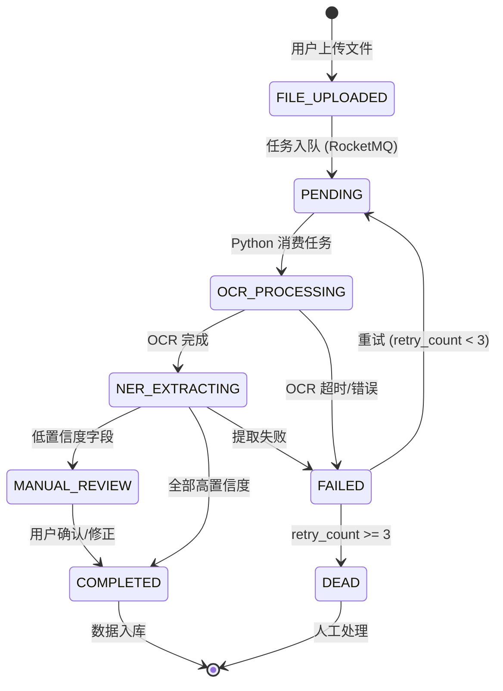
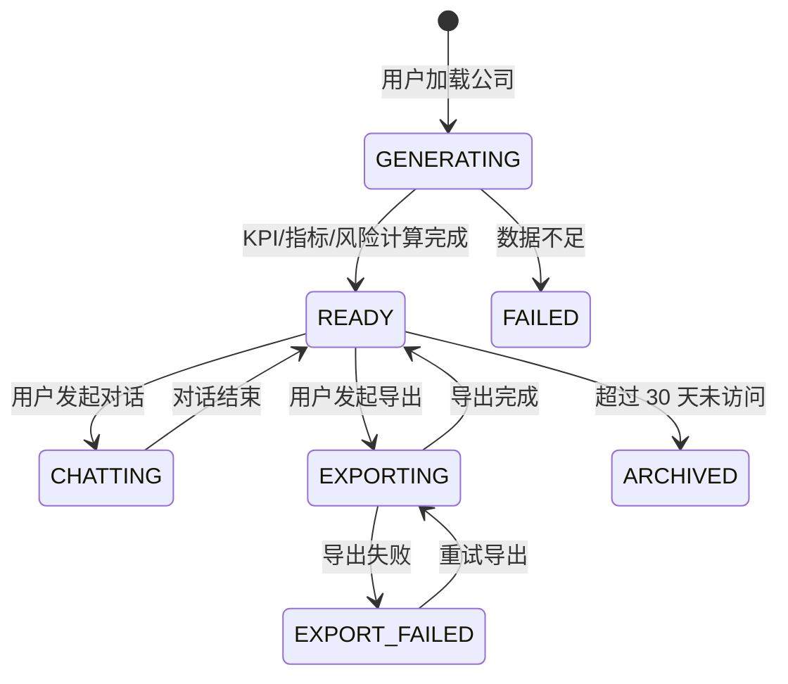
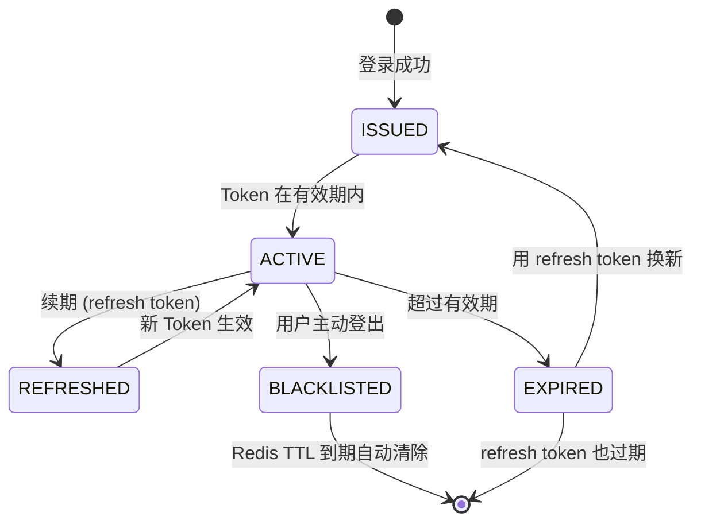
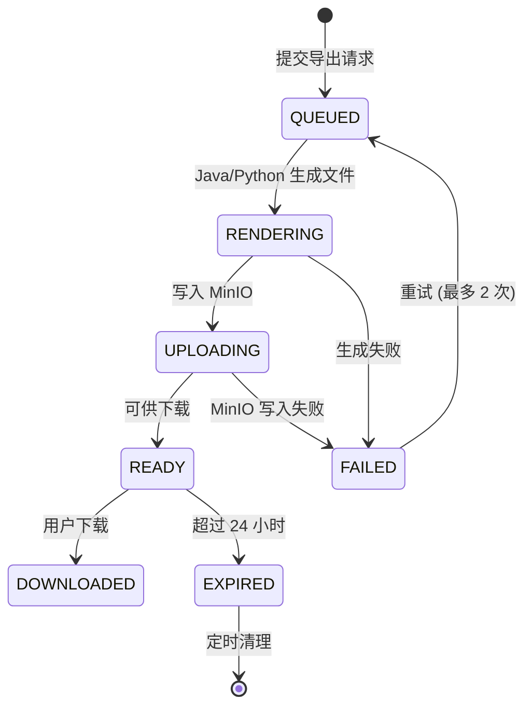

# SmartReport — 技术方案设计文档

> 基于 `tech-plan.md`，面向落地实施的技术架构详设  
> 日期：2026-05-29

---

## 技术栈总览

```
┌──────────────────────────────────────────────────────────────────┐
│                     Docker Compose                               │
│  ┌──────────┐  ┌──────────────┐  ┌──────────────────────────┐   │
│  │  Vue 3   │  │  Spring Boot │  │  Python FastAPI           │   │
│  │  (Nginx) │──│  (Java 17)   │──│  (AI 引擎)               │   │
│  │  :3000   │  │  :8080       │  │  :8000                    │   │
│  └──────────┘  └──┬───┬───┬──┘  └──────────┬───────────────┘   │
│                   │   │   │                 │                    │
│          ┌────────┘   │   └────────┐        │                    │
│          ▼            ▼            ▼        ▼                    │
│  ┌──────────┐ ┌──────────┐ ┌──────────┐ ┌──────────┐           │
│  │  MySQL   │ │  Redis   │ │RocketMQ  │ │  MinIO   │           │
│  │  :3306   │ │  :6379   │ │ :9876    │ │ :9000    │           │
│  └──────────┘ └──────────┘ └──────────┘ └──────────┘           │
└──────────────────────────────────────────────────────────────────┘
```

| 组件 | 端口 | 职责 |
|------|------|------|
| Vue 3 + Nginx | 3000 | 前端静态资源 + 反向代理 |
| Spring Boot | 8080 | 业务 API、JWT 认证、数据 CRUD |
| Python FastAPI | 8000 | AI 能力（LLM 调用、RAG、OCR、预测） |
| MySQL | 3306 | 主数据库 |
| Redis | 6379 | 缓存、Session、JWT 黑名单 |
| RocketMQ | 9876/10911 | Java ↔ Python 异步消息 |
| MinIO | 9000/9001 | 财报文件对象存储 |

**通信方式：**
- 前端 → Java：REST over HTTP（JWT Bearer Token）
- Java → Python：RocketMQ（异步任务）+ REST（同步查询）
- Python → Java：RocketMQ（任务结果回调）

---

## 一、数据库 ER 图

```mermaid
erDiagram
    users ||--o{ user_search_history : has
    users ||--o{ user_favorites : has
    users ||--o{ analysis_reports : generates

    companies ||--o{ financial_reports : publishes
    companies ||--o{ company_industry_tags : tagged
    companies ||--o{ user_favorites : favorited
    companies ||--o{ user_search_history : searched
    companies ||--o{ analysis_reports : belongs_to

    financial_reports ||--o{ financial_indicators : contains
    financial_reports ||--o{ report_files : has

    industry_averages ||--o{ financial_indicators : benchmarks

    highlight_rules ||--o{ report_highlights : generates
    risk_rules ||--o{ report_risks : generates

    analysis_reports ||--o{ report_highlights : has
    analysis_reports ||--o{ report_risks : has
    analysis_reports ||--o{ chat_messages : contains
    analysis_reports ||--o{ export_records : exported_as

    financial_indicators }o--|| indicator_definitions : defined_by

    %% ── 用户表 ──
    users {
        bigint id PK "自增主键"
        varchar email UK "邮箱（登录账号）"
        varchar password_hash "bcrypt 加密密码"
        varchar nickname "昵称"
        varchar avatar_url "头像URL（MinIO）"
        tinyint status "0禁用 1正常 2未验证"
        datetime created_at
        datetime updated_at
    }

    %% ── 公司表 ──
    companies {
        varchar code PK "股票代码 如600519"
        varchar name "公司名称 如贵州茅台"
        varchar short_name "简称"
        varchar industry "证监会行业分类"
        varchar market "SH/SZ/BJ"
        varchar listing_date "上市日期"
        tinyint status "0退市 1正常"
        datetime created_at
    }

    %% ── 公司行业标签 ──
    company_industry_tags {
        bigint id PK
        varchar company_code FK
        varchar tag "标签 如白酒、消费、龙头"
    }

    %% ── 财报主表 ──
    financial_reports {
        bigint id PK
        varchar company_code FK
        varchar report_type "annual/quarter1/quarter2/quarter3/semi_annual"
        int report_year "2024"
        varchar source "system/upload/manual"
        varchar source_file_url "MinIO 原始文件路径"
        tinyint status "0解析中 1已解析 2解析失败"
        datetime published_at "财报发布日期"
        datetime created_at
    }

    %% ── 财报原始文件 ──
    report_files {
        bigint id PK
        bigint report_id FK
        varchar file_name "原始文件名"
        varchar file_url "MinIO 存储路径"
        varchar file_type "pdf/docx/xlsx/jpg"
        bigint file_size "字节"
        datetime uploaded_at
    }

    %% ── 财务指标定义 ──
    indicator_definitions {
        varchar key UK "如 revenue, profit"
        varchar name "中文名：营业收入"
        varchar unit "亿/%"
        tinyint is_percentage "0数值 1百分比"
        varchar category "revenue/profit/debt/cashflow/ratio"
        varchar term_explanation "白话解释文案"
        int sort_order "展示排序"
    }

    %% ── 财务指标数值 ──
    financial_indicators {
        bigint id PK
        bigint report_id FK
        varchar indicator_key FK "对应 indicator_definitions.key"
        decimal value "指标值"
        decimal yoy_change "同比变化率"
        decimal qoq_change "环比变化率"
        varchar industry_avg "行业均值"
        varchar industry_rank "行业排名 如 top10%"
        varchar rating "评价：优秀/良好/健康/关注"
        datetime created_at
    }

    %% ── 行业均值 ──
    industry_averages {
        bigint id PK
        varchar industry "行业分类"
        varchar indicator_key FK
        int year
        decimal avg_value "行业均值"
        decimal median_value "行业中位数"
    }

    %% ── 亮点规则 ──
    highlight_rules {
        varchar rule_key PK "如 profit_gold_content"
        varchar indicator_key "关联指标"
        varchar condition_expr "如 value > 80 AND yoy_change > 0"
        varchar title "亮点标题模板"
        varchar desc_template "描述模板 {value} {indicator_name}"
        tinyint priority "优先级 0最高"
        tinyint enabled "是否启用"
    }

    %% ── 风险规则 ──
    risk_rules {
        varchar rule_key PK
        varchar indicator_key
        varchar condition_expr
        varchar title
        varchar desc_template
        tinyint priority
        tinyint enabled
    }

    %% ── 分析报告 ──
    analysis_reports {
        bigint id PK
        bigint user_id FK "可为空（匿名用户）"
        varchar company_code FK
        bigint report_id FK "关联的财报"
        varchar session_id "匿名会话ID"
        tinyint status "0生成中 1已完成 2失败"
        json summary_data "缓存的分析结果JSON"
        datetime created_at
    }

    %% ── 报告亮点 ──
    report_highlights {
        bigint id PK
        bigint analysis_report_id FK
        varchar rule_key FK
        varchar icon "emoji"
        varchar title
        text description
    }

    %% ── 报告风险 ──
    report_risks {
        bigint id PK
        bigint analysis_report_id FK
        varchar rule_key FK
        varchar icon
        varchar title
        text description
    }

    %% ── 聊天消息 ──
    chat_messages {
        bigint id PK
        bigint analysis_report_id FK "关联分析会话"
        varchar role "user/assistant"
        text content "消息内容"
        json rag_refs "RAG检索引用 [ {source, snippet, score} ]"
        int token_usage "消耗Token数"
        datetime created_at
    }

    %% ── 用户搜索历史 ──
    user_search_history {
        bigint id PK
        bigint user_id FK "可为空"
        varchar session_id "匿名会话ID"
        varchar company_code FK
        datetime searched_at
    }

    %% ── 用户收藏 ──
    user_favorites {
        bigint id PK
        bigint user_id FK
        varchar company_code FK
        datetime created_at
    }

    %% ── 导出记录 ──
    export_records {
        bigint id PK
        bigint analysis_report_id FK
        varchar format "png/pdf/word/excel"
        varchar file_url "MinIO 导出文件路径"
        tinyint status "0生成中 1已完成 2失败"
        datetime created_at
    }

    %% ── RocketMQ 任务表 ──
    mq_task_records {
        bigint id PK
        varchar task_id UK "RocketMQ messageId"
        varchar task_type "ocr/ner/predict/chat/export"
        json request_payload
        json response_payload
        varchar status "pending/processing/completed/failed"
        int retry_count "重试次数"
        datetime created_at
        datetime completed_at
    }
```



---

## 二、RESTful API 端点清单

> 约定：所有 Java API 前缀 `/api/v1`，Python API 前缀 `/ai/v1`  
> 认证：`Authorization: Bearer <JWT_TOKEN>`（标注 🔒 的需认证）

---

### 2.1 认证模块 `auth`

| 方法 | 路径 | 说明 | 认证 |
|------|------|------|------|
| POST | `/api/v1/auth/register` | 用户注册 | — |
| POST | `/api/v1/auth/login` | 用户登录，返回 JWT | — |
| POST | `/api/v1/auth/refresh` | 刷新 Token | 🔒 |
| POST | `/api/v1/auth/logout` | 登出（JWT 加入 Redis 黑名单） | 🔒 |
| GET | `/api/v1/auth/me` | 获取当前用户信息 | 🔒 |

**POST `/api/v1/auth/register`**

```json
// Request
{ "email": "user@example.com", "password": "Abc12345!", "nickname": "张三" }

// Response 201
{ "code": 0, "data": { "id": 1, "email": "user@example.com", "nickname": "张三" } }
```

**POST `/api/v1/auth/login`**

```json
// Request
{ "email": "user@example.com", "password": "Abc12345!" }

// Response 200
{
  "code": 0,
  "data": {
    "accessToken": "eyJhbGciOi...",
    "refreshToken": "eyJhbGciOi...",
    "expiresIn": 7200,
    "user": { "id": 1, "email": "user@example.com", "nickname": "张三" }
  }
}
```

---

### 2.2 搜索模块 `search`

| 方法 | 路径 | 说明 | 认证 |
|------|------|------|------|
| GET | `/api/v1/search/companies` | 模糊搜索公司 | — |
| GET | `/api/v1/search/companies/hot` | 热门搜索公司 | — |

**GET `/api/v1/search/companies?q=茅台&limit=8`**

```json
// Response 200
{
  "code": 0,
  "data": [
    { "code": "600519", "name": "贵州茅台", "shortName": "贵州茅台", "industry": "白酒", "market": "SH" },
    { "code": "000858", "name": "五粮液", "shortName": "五粮液", "industry": "白酒", "market": "SZ" }
  ]
}
```

---

### 2.3 财报数据模块 `reports`

| 方法 | 路径 | 说明 | 认证 |
|------|------|------|------|
| GET | `/api/v1/reports/{companyCode}/latest` | 获取最新财报摘要 | — |
| GET | `/api/v1/reports/{companyCode}/kpi` | KPI 指标卡片数据 | — |
| GET | `/api/v1/reports/{companyCode}/timeline` | 关键指标时间序列 | — |
| GET | `/api/v1/reports/{companyCode}/indicators` | 核心指标详解列表 | — |

**GET `/api/v1/reports/600519/kpi`**

```json
// Response 200
{
  "code": 0,
  "data": {
    "company": { "code": "600519", "name": "贵州茅台" },
    "reportYear": 2024,
    "reportType": "annual",
    "kpis": [
      { "key": "revenue", "name": "营业总收入", "value": 1748, "unit": "亿", "yoy": 16.1, "trend": "up" },
      { "key": "profit", "name": "归母净利润", "value": 862, "unit": "亿", "yoy": 15.4, "trend": "up" },
      { "key": "debtRatio", "name": "资产负债率", "value": 16.1, "unit": "%", "yoy": -1.1, "trend": "down_good" },
      { "key": "cashFlow", "name": "经营现金流", "value": 810, "unit": "亿", "yoy": 21.6, "trend": "up" }
    ]
  }
}
```

**GET `/api/v1/reports/600519/timeline?metrics=revenue,profit,grossMargin`**

```json
// Response 200
{
  "code": 0,
  "data": {
    "years": ["2020", "2021", "2022", "2023", "2024"],
    "metrics": [
      { "key": "revenue", "name": "营业收入", "unit": "亿", "values": [980, 1095, 1276, 1506, 1748] },
      { "key": "profit", "name": "归母净利润", "unit": "亿", "values": [467, 525, 627, 747, 862] },
      { "key": "grossMargin", "name": "毛利率", "unit": "%", "values": [91.3, 91.8, 92.1, 92.5, 92.8] }
    ]
  }
}
```

---

### 2.4 风险与亮点模块 `analysis`

| 方法 | 路径 | 说明 | 认证 |
|------|------|------|------|
| GET | `/api/v1/analysis/{companyCode}/highlights` | 经营亮点 | — |
| GET | `/api/v1/analysis/{companyCode}/risks` | 风险识别 | — |
| GET | `/api/v1/analysis/{companyCode}/predict` | 趋势预测数据 | — |
| GET | `/api/v1/analysis/{companyCode}/predict/insights` | 预测洞察文案 | — |
| GET | `/api/v1/analysis/{companyCode}/benchmark` | 行业对比数据 | — |
| GET | `/api/v1/terms` | 财务术语释义字典 | — |

**GET `/api/v1/analysis/600519/highlights`**

```json
// Response 200
{
  "code": 0,
  "data": [
    { "id": 1, "icon": "🏆", "title": "品牌护城河深厚", "description": "作为行业龙头...毛利率超92.8%。", "ruleKey": "brand_moat" },
    { "id": 2, "icon": "📊", "title": "盈利能力卓越", "description": "净利率持续保持在49.3%以上...", "ruleKey": "profitability" }
  ]
}
```

**GET `/api/v1/analysis/600519/risks`**

```json
// Response 200
{
  "code": 0,
  "data": [
    { "id": 1, "icon": "📉", "title": "利润增速放缓", "description": "近两年归母净利润增速从高位回落至15%左右...", "ruleKey": "profit_slowdown" },
    { "id": 2, "icon": "🏛️", "title": "政策监管风险", "description": "行业面临政策调整不确定性...", "ruleKey": "policy_risk" }
  ]
}
```

**GET `/api/v1/analysis/600519/predict`**

```json
// Response 200
{
  "code": 0,
  "data": {
    "years": ["2020","2021","2022","2023","2024","2025E","2026E"],
    "series": [
      { "key": "revenue_actual", "name": "营收（实际）", "type": "solid", "values": [980,1095,1276,1506,1748,null,null] },
      { "key": "revenue_predict", "name": "营收（预测）", "type": "dashed", "values": [null,null,null,null,1748,1958,2154] },
      { "key": "profit_actual", "name": "净利润（实际）", "type": "solid", "values": [467,525,627,747,862,null,null] },
      { "key": "profit_predict", "name": "净利润（预测）", "type": "dashed", "values": [null,null,null,null,862,948,1033] }
    ]
  }
}
```

---

### 2.5 聊天问答模块 `chat`（Java 透传 + Python 生成）

| 方法 | 路径 | 说明 | 认证 |
|------|------|------|------|
| POST | `/api/v1/chat/messages` | 发送消息（SSE 流式响应） | — |
| GET | `/api/v1/chat/messages` | 获取历史消息 | — |
| DELETE | `/api/v1/chat/messages` | 清空当前会话消息 | — |
| GET | `/api/v1/chat/messages/export` | 导出聊天记录 (.txt) | — |

**POST `/api/v1/chat/messages`**（SSE 流式）

```json
// Request
{ "companyCode": "600519", "message": "这家公司盈利能力怎么样？", "sessionId": "uuid" }

// Response — SSE Stream (Content-Type: text/event-stream)
data: {"type":"thinking","content":"正在检索相关财报..."}

data: {"type":"token","content":"根据"}

data: {"type":"token","content":"贵州茅台"}

data: {"type":"token","content":"2024年"}

data: {"type":"refs","refs":[{"source":"2024年报-管理层讨论","snippet":"...毛利率92.8%...","score":0.92}]}

data: {"type":"done","tokenUsage":342}
```

> 流程：前端 → Java `/api/v1/chat/messages` → RocketMQ → Python 异步处理 → SSE 推回 Java → 前端

---

### 2.6 上传模块 `upload`

| 方法 | 路径 | 说明 | 认证 |
|------|------|------|------|
| POST | `/api/v1/upload/report` | 上传财报文件 | — |
| GET | `/api/v1/upload/tasks/{taskId}` | 查询解析进度 | — |
| POST | `/api/v1/upload/manual` | 手动文本提交 | — |

**POST `/api/v1/upload/report`**（multipart/form-data）

```
// Request
Content-Type: multipart/form-data
file: 贵州茅台2024年报.pdf

// Response 202
{
  "code": 0,
  "data": {
    "taskId": "task_abc123",
    "status": "pending",
    "fileName": "贵州茅台2024年报.pdf",
    "message": "文件已上传，正在排队解析..."
  }
}
```

**GET `/api/v1/upload/tasks/task_abc123`**

```json
// Response 200
{
  "code": 0,
  "data": {
    "taskId": "task_abc123",
    "status": "processing",
    "progress": { "stage": "ocr", "message": "正在 OCR 识别第 3/12 页...", "percent": 45 },
    "result": null
  }
}

// Response 200 (完成时)
{
  "code": 0,
  "data": {
    "taskId": "task_abc123",
    "status": "completed",
    "progress": { "stage": "done", "message": "解析完成", "percent": 100 },
    "result": { "companyCode": "600519", "reportYear": 2024, "extractedIndicators": {...} }
  }
}
```

---

### 2.7 导出模块 `export`

| 方法 | 路径 | 说明 | 认证 |
|------|------|------|------|
| POST | `/api/v1/export` | 提交导出任务 | — |
| GET | `/api/v1/export/tasks/{taskId}` | 查询导出进度 | — |
| GET | `/api/v1/export/download/{taskId}` | 下载导出文件 | — |

**POST `/api/v1/export`**

```json
// Request
{ "companyCode": "600519", "format": "pdf", "includeModules": ["overview","predict","risks"] }

// Response 202
{ "code": 0, "data": { "taskId": "export_def456", "status": "pending" } }
```

---

### 2.8 历史模块 `history`

| 方法 | 路径 | 说明 | 认证 |
|------|------|------|------|
| GET | `/api/v1/history` | 获取分析历史 | —（匿名按 sessionId） |
| POST | `/api/v1/history` | 记录分析历史 | — |
| DELETE | `/api/v1/history/{id}` | 删除单条历史 | — |

---

### 2.9 Python FastAPI 内部接口（仅 Java ↔ Python 通信）

| 方法 | 路径 | 说明 | 调用方 |
|------|------|------|--------|
| POST | `/ai/v1/chat/generate` | LLM 对话生成（SSE） | Java |
| POST | `/ai/v1/rag/search` | 向量检索 | Java |
| POST | `/ai/v1/ocr/parse` | OCR 识别 | RocketMQ |
| POST | `/ai/v1/ner/extract` | 财报文本结构化提取 | RocketMQ |
| POST | `/ai/v1/predict/forecast` | 财务预测计算 | Java |
| POST | `/ai/v1/embeddings/index` | 财报文本向量化入库 | RocketMQ |
| GET | `/ai/v1/health` | 健康检查 | Java |

**POST `/ai/v1/chat/generate`**（内部 SSE）

```json
// Request
{
  "companyCode": "600519",
  "message": "盈利能力怎么样？",
  "history": [
    { "role": "user", "content": "..." },
    { "role": "assistant", "content": "..." }
  ],
  "ragContext": [
    { "source": "2024年报-P12", "snippet": "毛利率达92.8%，同比提升0.3个百分点..." }
  ]
}

// Response — SSE Stream
data: {"token":"贵州茅台"}
data: {"token":"2024年"}
...
data: {"done":true,"tokenUsage":342}
```

---

### 2.10 基础设施端点

| 方法 | 路径 | 说明 |
|------|------|------|
| GET | `/api/v1/health` | Java 健康检查 |
| GET | `/actuator/health` | Spring Actuator |
| GET | `/actuator/metrics` | Prometheus 指标 |
| GET | `/ai/v1/health` | Python 健康检查 |

---

## 三、关键状态机

### 3.1 文件上传 → 解析 → 分析 全流程



| 状态 | 说明 | 超时 | 重试策略 |
|------|------|------|----------|
| `FILE_UPLOADED` | 文件已写入 MinIO | — | — |
| `PENDING` | 等待 Python 消费 | 5min | — |
| `OCR_PROCESSING` | PaddleOCR 识别中 | 10min | 最多 3 次 |
| `NER_EXTRACTING` | LLM 结构化提取 | 5min | 最多 3 次 |
| `MANUAL_REVIEW` | 等待用户修正 | 24h | — |
| `COMPLETED` | 数据已入库 | — | — |
| `FAILED` | 可重试失败 | — | 退避延迟：1min/5min/15min |
| `DEAD` | 不可恢复 | — | 通知管理员 |

### 3.2 分析报告生命周期



### 3.3 JWT Token 生命周期



| Token 类型 | 有效期 | 存储位置 |
|------------|--------|----------|
| Access Token | 2 小时 | 前端内存（不持久化） |
| Refresh Token | 7 天 | HttpOnly Cookie 或安全存储 |
| Blacklist Key | = Access Token 剩余 TTL | Redis `bl_:{token_hash}` |

### 3.4 导出任务状态



---

## 四、技术风险与替代方案

### 风险矩阵

| # | 风险 | 严重度 | 概率 | 影响 | 缓解方案 | 替代方案 |
|---|------|--------|------|------|----------|----------|
| **R1** | **RocketMQ 运维复杂** | 🔴 高 | 中 | Java↔Python 通信中断，AI 功能不可用 | 1. 提前编写 docker-compose 一键部署脚本<br>2. 配置监控告警（RocketMQ Console）<br>3. 关键路径加 HTTP 同步降级 | 降级为 **RabbitMQ**（更成熟，社区更大）或 **Redis Stream**（轻量场景够用） |
| **R2** | **LLM API 调用延迟/不稳定** | 🔴 高 | 高 | 用户等待时间过长，体验差 | 1. SSE 流式响应<br>2. 前端打字机效果缓解等待感<br>3. 设置 30s 超时 + 兜底回复<br>4. 多 Provider 热备（DeepSeek → 智谱） | 自部署 **开源模型**（如 Qwen2.5-7B）作为离线备选；完全不可用时降级为**规则匹配回复**（现有模拟逻辑） |
| **R3** | **RAG 检索质量不达标** | 🟡 中 | 中 | AI 回答不够准确，用户不信任 | 1. 财报段落精细切分（按章节/段落）<br>2. 混合检索（BM25 + 向量）<br>3. Reranker 重排序<br>4. 人工评测 Top-K 召回率 | 初期先用 MySQL **全文索引**（`MATCH...AGAINST`）做关键词检索，快速上线 |
| **R4** | **OCR 识别准确率低** | 🟡 中 | 中 | 财报数据提取错误，分析结果失真 | 1. PaddleOCR 中文模型效果已验证 >95%<br>2. 低置信度字段标记为需人工确认<br>3. 表格区域专项优化（TableBank 模型） | **百度 OCR API**（商业级，准确率更高）；极端场景引导用户**手动输入** |
| **R5** | **MySQL 大表查询性能** | 🟡 中 | 低 | `financial_indicators` 数据量增长后查询变慢 | 1. 合理索引（复合索引全覆盖）<br>2. Redis 缓存热点数据（KPI/Timeline）<br>3. 按年份分表（`financial_indicators_2024`） | **ClickHouse**（列存，OLAP 查询场景更优）；**TiDB**（MySQL 兼容 + 水平扩展） |
| **R6** | **MinIO 单点故障** | 🟡 中 | 低 | 文件上传/下载不可用 | 1. Docker Compose 配置健康检查 + 自动重启<br>2. 定时备份到本地磁盘 | **阿里云 OSS**（生产环境推荐，SLA 更高） |
| **R7** | **前端 Chart.js 大数据量卡顿** | 🟢 低 | 低 | 多年份多指标时渲染慢 | 1. 数据抽样/降采样<br>2. Web Worker 计算<br>3. Canvas 离屏渲染 | **ECharts**（大数据量 WebGL 渲染）；**Apache ECharts + 服务端渲染** |
| **R8** | **JWT 无状态无法强制踢人** | 🟢 低 | 低 | 管理员无法立即使某 Token 失效 | Redis 黑名单机制（已有设计）<br>Access Token 设置短 TTL（2h） | **OAuth2 + Session**（但增加服务端状态） |
| **R9** | **Docker Compose 单机瓶颈** | 🟢 低 | 低 | 初期单机够用，后期需水平扩展 | 提前做好无状态设计（Session 放 Redis、文件放 MinIO） | 迁移至 **K8s**（Docker Compose → Kompose 一键转换） |
| **R10** | **Spring Boot + Python 双语言维护成本** | 🟢 低 | 中 | 团队需要掌握两种技术栈 | 1. Python 仅限 AI 相关模块，边界清晰<br>2. 接口契约明确（OpenAPI 文档）<br>3. 集成测试覆盖关键链路 | 全部 Java：用 **Spring AI** + **LangChain4j** 替代 Python（但 AI 生态不如 Python 成熟） |

---

## 五、关键设计决策记录

| 决策项 | 选择 | 理由 |
|--------|------|------|
| 双后端语言 | Spring Boot + FastAPI | Java 处理业务 CRUD（生态成熟、类型安全）；Python 处理 AI（LLM/OCR/NLP 生态最强） |
| 消息队列 | RocketMQ | 阿里系生态、支持事务消息、延迟消息；适合 Java↔Python 异步解耦 |
| 数据库 | MySQL | 团队熟悉度高、生态工具完善；结构化财报数据天然适合关系型 |
| 对象存储 | MinIO | S3 兼容、Docker 部署简单、无厂商锁定 |
| API 风格 | REST + SSE | 常规操作用 REST；AI 流式响应用 SSE（比 WebSocket 更轻量） |
| 认证方案 | JWT + Redis 黑名单 | 无状态水平扩展友好；Redis 黑名单弥补 JWT 无法主动失效的短板 |
| 部署 | Docker Compose | MVP 阶段够用，与 K8s 迁移路径兼容 |

---

## 六、Docker Compose 目录结构建议

```
project-root/
├── docker-compose.yml
├── docker-compose.override.yml       # 本地开发覆盖
├── .env                               # 环境变量
├── frontend/                          # Vue 3 项目
│   ├── Dockerfile
│   ├── nginx.conf
│   └── src/
├── backend-java/                      # Spring Boot 项目
│   ├── Dockerfile
│   ├── pom.xml
│   └── src/
├── backend-python/                    # FastAPI 项目
│   ├── Dockerfile
│   ├── requirements.txt
│   └── app/
├── rocketmq/
│   └── broker.conf
├── mysql/
│   └── init.sql                       # 建表 DDL
├── minio/
│   └── data/
└── docs/
    ├── product-analysis.md
    ├── tech-plan.md
    └── tech-design.md                 ## 本文档
```
